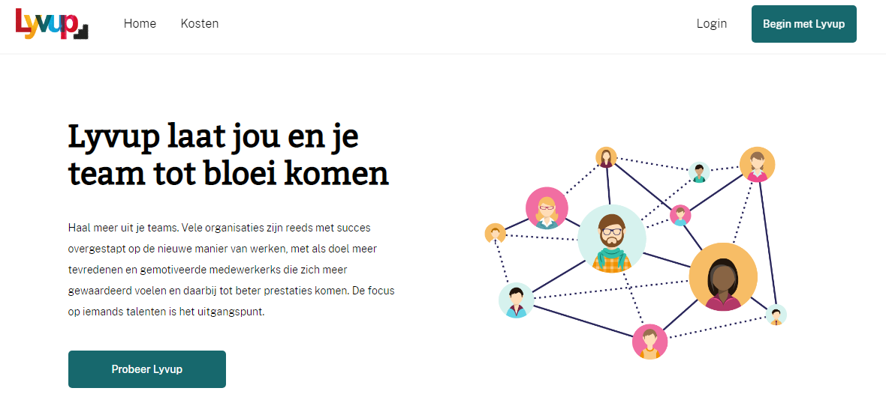

# Meesterproef 1920 | Praise-app

I have picked the praise-app to be my project, along with 4 other teammates we worked 5 weeks on creating a whole new frontend experience for Lyvup and we are all very happy to share our work!

## Prototype repo/link
Check out the [Repository](https://github.com/StefanGerrits2/Lyvup-prototype) for our prototype or the [live link](https://lyvup.herokuapp.com/).

## Assignment
The assignment was divided in 2 parts by Lyvup, each having their own unique purpose.

### 1. Redesign of the current front-end
Lyvup already has a running application, one of our jobs was to take every page from the current app and redesign it's whole front-end giving it a new look and feel.

### 2. The lunchbox (onboarding wizard)
The second part of the assigment was to develop what they originally called 'The Lunchbox', which is a onboarding wizard for new users give them just a little taste of Lyvup is like. The lunchbox is supposed to encourage someone to pay for the premium version of Lyvup.

## [Wiki](https://github.com/mich97/meesterproef-1920/wiki)
Most of the documentation for this project can be found in the [wiki](https://github.com/mich97/meesterproef-1920/wiki). The documenteation includes the following articles:

* [Debriefing](https://github.com/mich97/meesterproef-1920/wiki/0.0-Debriefing)
* [Design Rationele](https://github.com/mich97/meesterproef-1920/wiki/1.0-Design-Rationale)
* Productbiopgraphy 🌱
  * [Week 1](https://github.com/mich97/meesterproef-1920/wiki/2.1-Week-1)
  * [Week 2](https://github.com/mich97/meesterproef-1920/wiki/2.2-Week-2)
  * [Week 3](https://github.com/mich97/meesterproef-1920/wiki/2.3-Week-3)
  * [Week 4](https://github.com/mich97/meesterproef-1920/wiki/2.4-Week-4)
  * [Week 5](https://github.com/mich97/meesterproef-1920/wiki/2.5-Week-5)
* Course Rubric 🤓
  * [Web App From Scratch](https://github.com/mich97/meesterproef-1920/wiki/3.1-Web-App-From-Scratch)
  * [CSS to the Rescue](https://github.com/mich97/meesterproef-1920/wiki/3.2-CSS-to-the-Rescue)
  * [Progressive Web Apps](https://github.com/mich97/meesterproef-1920/wiki/3.3-Progressive-Web-Apps)
  * [Browser Technologies](https://github.com/mich97/meesterproef-1920/wiki/3.4-Browser-Technologies)
  * [Real Time Web](https://github.com/mich97/meesterproef-1920/wiki/3.5-Real-Time-Web)
  * [Web Design](https://github.com/mich97/meesterproef-1920/wiki/3.6-Web-Design)
* [Reflection](https://github.com/mich97/meesterproef-1920/wiki/4.0-Reflection)

## Additional documentation
Some addittional documenatation can be found on our [Gitbook](https://reinier-van-limpt.gitbook.io/lyvup-complimenten-app/nieuwe-use-cases). It includes the following articles:
- [Use Cases from existing app](https://reinier-van-limpt.gitbook.io/lyvup-complimenten-app/use-cases-huidige-versie)
- [Possible new Use Cases](https://reinier-van-limpt.gitbook.io/lyvup-complimenten-app/nieuwe-use-cases)
- [Lunchbox/onboarding wizard research](https://reinier-van-limpt.gitbook.io/lyvup-complimenten-app/documentatie-lunchbox)
- [Customar Journeys](https://reinier-van-limpt.gitbook.io/lyvup-complimenten-app/customer-journeys)
- [Tasks for enhancing the front-end](https://reinier-van-limpt.gitbook.io/lyvup-complimenten-app/enhancing-the-frontend)

## Team
The team I've been working with during the 5 weeks, under coaching of [Koop Reynders](https://github.com/KoopReynders).
- [Monika Streljajeva](https://github.com/MonikaaS)
- [Stefan Gerrits](https://github.com/StefanGerrits2)
- [Reinier van Limpt](https://github.com/ReiniervanLimpt)
- [Max weijers](https://github.com/mordock)
- [Michel Abdad (me)](https://github.com/mich97)